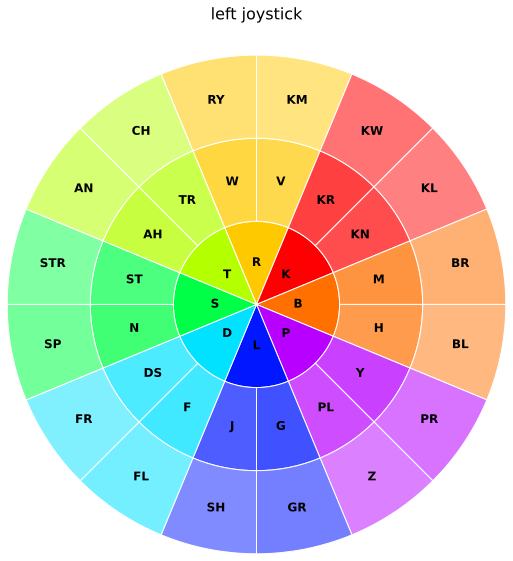
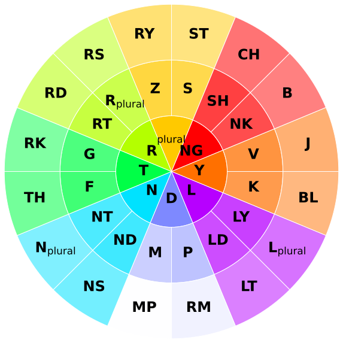
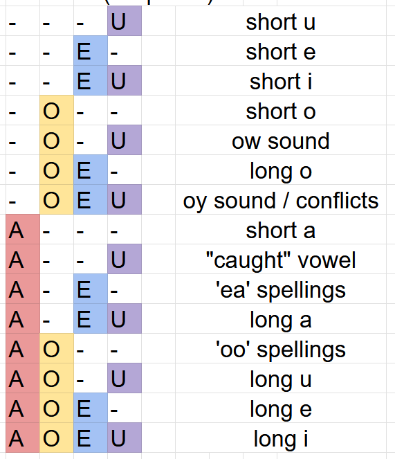

# Full layout

| Left joystick | Right joystick |
|------|-------|
|  |  |

Short vowels can be 

spelling based (WACH -> watch)

Or phonetic (WOCH -> watch)

(if you're American, then WAUCH -> watch, but that won't be in the dictionary, so try sticking to spelling)

