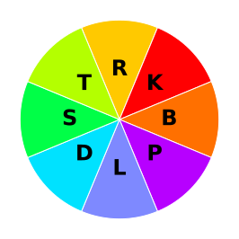
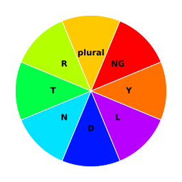

# Mussel Power Theory Textbook

Welcome to Mussel Power's theory textbook!

Machine stenography (steno) is a method of text input that utilises "chording" to allow you to write any word

This textbook should give you everything you need to start stenoing on a controller or trackpad.

Steno works well with a reduced layout, hence it's a great fit for controllers. You will notice some sounds are "missing" and others are duplicated, this is explained in later chapters.

| Left joystick | Left trig | Left bump | Right bump | Right trig | Right joystick |
|------|-------|-------|-------|-------|-------|
|  | `A`| `O` |`E` | `U` |  |